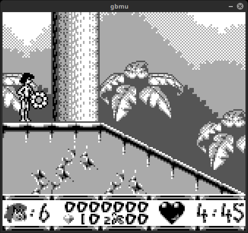
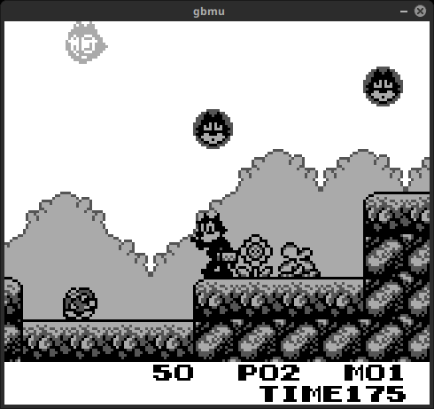
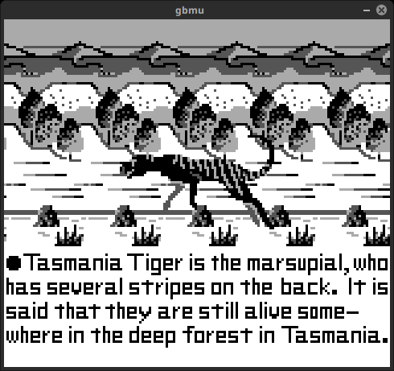
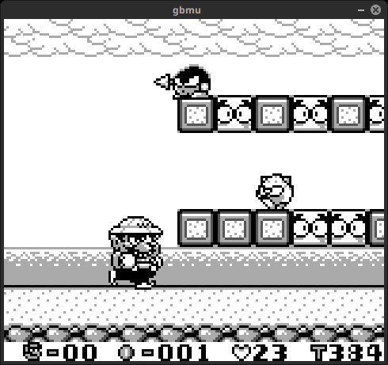

# gbmu


#### description:

work in progress; gameboy emulator in c;


#### building on linux:

`apt install libsdl2-dev`

`make`


#### building on macOS:

`brew install sdl2`

`make`


#### usage:

```
./gbmu [options] rom_file.gb

  options:
   -s <ip address>          : server
   -c <ip address>          : client
   -p <port>                : port
```


#### netplay:

for netplay on two different computers, first computer has to run a server instance: `./gbmu -s 10.113.5.26 Tetris.gb`

second computer has to run a client instance `./gbmu -c 10.113.5.26 Tetris.gb`

ip address should be of computer running the server instance

-

for netplay on the same computer:
    `f=Tetris.gb; nice -n0 nohup ./gbmu -s "$f" &; nice -n0 nohup ./gbmu -c "$f" &;`


#### controls:

|gameboy|gbmu|
|-|-|
|directional pad|arrow keys|
|b|z|
|a|x|
|start|return|
|select|right shift|


#### settings:

`-`, `=` sound volume

`1`-`5` screen size

`q`, `w` palette


#### screenshots

[](screenshots/screenshot1.png "screenshots/screenshot1.png")

[](screenshots/screenshot2.png "screenshots/screenshot2.png")

[](screenshots/screenshot3.png "screenshots/screenshot3.png")

[](screenshots/screenshot4.png "screenshots/screenshot4.png")

